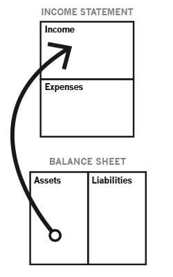
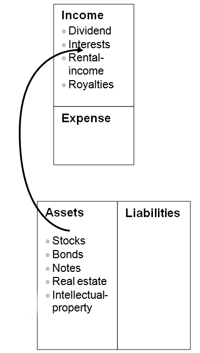
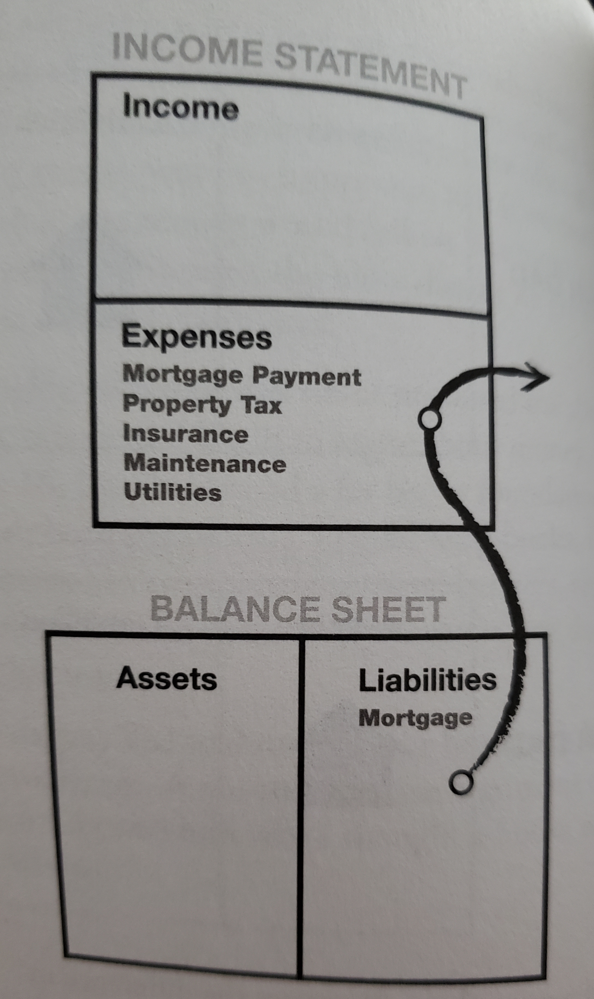

I was a bit late to read "Rich Dad Poor Dad" by [Robert Kiyosaki](https://twitter.com/theRealKiyosaki) but I have crossed that off my list in 2019. I think it is one of the most influential (although the effects are too early to measure right now) books that I have read in a **long** time. There are 2 things that the book does extremely well -
- It takes existing and known concepts around financial literacy and planning and sheds new light on it, in a way that makes it hard hitting & impactful.
- It does not explain the nitty gritty details (eg. of what you should buy to get rich) but leaves enough of a template for you to investigate yourself and think of how you can customize it. As a result, it provides clear _first principles_, which I think go a lot further. As the saying goes - "Teach a man to fish..." 

This summary is part of my journey to become more financially literate and while some of these concepts are obvious to others, they sparked something in me which is why I chose to highlight these. 

1. **Understanding assets and liabilities with respect to Cashflow**

Having a simplistic template for both the `Income statement` and `Balance Sheet` helped think of a bunch of new concepts namely

- *Cashflow pattern of an asset*
    
This basically indicates that an asset is something that will create income and does _not_ cause you expenses in the long run

To focus on this just a bit more, an example of how a rich person thinks of cashflow for assets is shown by 

This diagram says that to be rich, you need a varied (diversified) set of streams of income and from what I have read, which ostensibly isn't a whole lot, most millionaires have 7 streams of income on an average. You can read about it anywhere on the interwebs really, but here is [one](https://www.linkedin.com/pulse/7-income-streams-most-millionaires-manoj-arora/)

- *Is a house an asset or liability?*

This is something that I think about a lot and in the past I have always thought buying a house is the _right_ thing to do. As I have gotten older, that has changed quite a bit and I have moved to the camp of thought that buying a house is a liability rather than an asset. This is crystallized by what I read in the book, an excerpt of which is [here](https://www.richdad.com/is-house-an-asset)

>>> But in the real world where you need money in your pocket to survive, if you have a house, paid for or not, that you live in, then it really isn’t an asset. Instead of putting money in your pocket, it takes money out of your pocket in the form of a mortgage, utility payments, taxes, maintenance, and more. That is the simple definition of a liability.

In the book, Robert highlights the 3 opportunities you lose if you invest in an expensive house early on - 
- Loss of time
- Loss of additional capital - Money tied in the house can be put elsewhere as better investment vehicles
- Loss of education - Losing the ability to become a sophisticated investor due to commitments towards the house

This isn't to say I won't buy a house, but I will _try_ to make the cashflow work towards the purchase of the house as opposed to relying on the notion of the house being an asset. 

- *Deep focus on acquiring assets*

Focusing on purchasing assets that are income generators rather than picking up things that seem like assets and are more likely liabilities. I know this sounds like a repetition but really understanding what that means is **key** to making sure you are making the right decisions for the right reasons.

2. **Increasing financial literacy**

We do not get taught any of the basics of investment until we either choose to do it ourselves in our 20s or we take classes late in college. I believe it is a failure of our education systems collectively, globally. While traditional subjects like Algebra, Geometry and Literature are important, the fact that we go through formative phases of our lives without learning about one of the most core pieces of our lives is fairly shocking.

A logical evolution for me includes learning and really understanding investment vehicles that I have ignored thus far, including tax-lien certificates which are a real mindbender for me, and something that I will write about in more detail once I understand the details of it myself. 
Personally, I get comfortable buying the staples - mutual funds, stocks, ETFs, but there is a wealth ( pun intended ) of options (also pun intended) out there including options, real estate etc. I want to spend the year reading and learning more about these more esoteric alternatives and going deeper down that rabbit hole. 
The main thing to make sure would be to not be naive and know **exactly** what I am getting into because these moves can be hugely risky and need precise understanding of pros and cons.

3. **Paying taxes**

I pay about ~36% taxes, which I am fine with paying as long as it gets used and not abused. My point here isn't about the actual share of taxes, but how the book made me think of how much _effort_ goes into paying taxes. 36% of the year is basically 19 weeks which equates to just under 5 months. This basically means that from January to May you are working for the government. A contrived but a powerful example of what your contributions really end up meaning. 

4. **What is "Wealth" ?** 

Wealth is not intended to be a trope to show off, but is more definitionally aligned with financial freedom. From the book - 
>>> Wealth is the person's ability to survive so many number of days forward - or if I stopped working today, how long can I survive? 

While by itself that is incredibly interesting, Robert takes it one step further by defining it as 
>> Wealth is the measure of the cash flow from the asset column compared with the expense column

This to me is absolutely mindblowing. This really drives home the point, that if you focus on picking assets that are provide income, you can create a runway for yourself without needing to rely on your paycheck as the main source of sustenance. This also craftily decouples the concept of "richness" from "wealth" which is an important distinction to make. 

This point here, is my biggest takeaway from the book. I still don't fully understand what it means specifically for me, but I am super excited to explore this concept further.

5. **What is your business?**

People tend to confuse their profession with being their business. As an example, if I asked what was your business, and you said "I work in Ad Tech", unless you own the company, that answer is not relevant to the question. The book had an interesting perspective of pivoting your idea of business around the "Asset column" in the diagrams above and not the "Income column". This would help you see what your primary sources of cashflow are, from that asset column to help you determine the answer to that question. 

Some other points worthy of highlighting from the book include - 

- Financial IQ is said to have 4 parts 
    - Accounting
    - Investing
    - Knowledge of the markets 
    - The Law 
    The last point is especially interesting, because the book goes into a small amount of detail of creating personal corporations which is something that I definitely do not know enough about to have an opinion, but is yet another train of thought that I want to follow further. 

- Don't hesitate to pay people who are good at what they do, if it means you can rely on their counsel and services without having to stress about those areas. 
This was something that was very different from the way I thought of things, in terms of not wanting to pay too much money to specialists (like real estate brokers or tax accountants) but having read through several examples of this in the book, I am certainly open to rethinking my stance on this one, if it means it will get me closer to my goals 

- Raising capital for your investments does not mean you have to go to the bank for a loan. 
Yet another point for me to understand myself, because the naive approach would be to ask for a loan/credit when you don't have the money to cover the purchase. However, navigating alternatives like providing written contracts between a buyer and seller (if it is an exchange transaction) are nifty to think about rather than the ways everybody else thinks about it. 

Towards the end of the book, Robert offers a rapid-fire set of TODOs which are actually helpful, even though they might seem pithy. These include - 
- Stop doing what you are doing, in terms of financial actions, that are not yielding results
- Look for new ideas 
- Find someone who has done what you want to do 
- Take classes, read and attend seminars 
- Make lots of offers 
- Action always beats inaction

All in all, I am really impressed by the book and while there is no telling what I will gain from the book, I am excited that the answer to that question lies in the journey that I will undertake from this point forward.