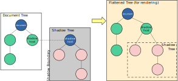

Towards the end of December, I tried to push a change to my website (built with Gatsby) and realized that the recent Catalina upgrade on my Mac left one of the Gatsby plugins completely broken. This post is about the learning I got from the next iteration of my personal website, so I will begin by saying that I decided that I do not need a heavy Javascript framework to publish my personal content. 💥


After this little epiphany, I figured why not go all the way down to the bones and try to resurrect the next version of arjunrao.co, using just HTML, CSS and maybe some JS (how original!). Ordinarily, this would be a non-story, but a few things made this more challenging that I initially foresaw - 
1. I haven't had the chance to write something in this vanilla stack for several years now, so I wanted to see what things I could learn/talk about with a new lens.
2. I did not want to use any frameworks of any kind, for the construction of the site itself. The intent was to not rely on 3rd party plugins and update cycles to host a simple personal blog. I slipped on this a little bit, but more to come on this in a while. 
3. I wanted to continue writing my blog posts in raw markdown and have them available on my static site - especially so because I had markdown posts dating back 5 years, that I didn't want to have to rewrite in something else. 

Here are some of my learnings from this experience. 

# 📚 What "stack" should I use? 

To reiterate, right out of the gate, I knew that despite there being some really cool frameworks & libraries like Vue, React, Nuxt, Next - I didn't want any of those advanced features (PWA, SSR etc) for my site. I didn't want to have to deal with `package.json` files and `yarn install` commands that resulted in intransigient errors like this - 


However, I knew that I wanted to use markdown to write my posts, since its 2021 and I didn't want to have to go write formatted HTML 🤮. 

That train of thought led me to the 2nd tier of "frameworks" - those geared towards markdown publishing, namely Jekyll, Hugo, Eleventy and the like. However, in terms of first principles, I didn't want anything where too much of the magic was happening behind the scenes, for similar concerns of backwards compatibility. 

After several hours of scouring the internet(shocking!), and nearly giving up, I stumbled upon [zero-md](https://zerodevx.github.io/zero-md/). Based on their definition - 

> A native markdown-to-html web component based on Custom Elements V1 specs to load and display an external MD file

it turned out to be _exactly_ what I needed.

# 🚧 Development with the vanilla stack

## Local development
Before I could get started with zero-md, I wanted to figure out what I wanted my local dev environment to look like. Starting off with a simple folder which had an index.html, containing some baseline html tag content was the easy part. I could technically just open that file in a browser and call it a day. However, as I started adding other pages, like "About me", that started to get annoying.

I came across [http-server](https://www.npmjs.com/package/http-server), which promised to be 
> powerful enough for production usage, but it's simple and hackable enough to be used for testing, local development, and learning.

I knew my eventual deployment of the app would be as a static site, but if I could use it for local development, that might save me the hassle of bouncing through different chrome tabs for testing my buildout. 


I realized that I was slipping from my original draconian "I DO NOT WANT TO USE FRAMEWORKS", as I describe what amounts to a yarn installation. However, my mental gymnastics to justify this included not _needing_ http-server as part of development or deployment, but it merely being a convenience. If this were to break or not work in the future, I could easily toss it away without needing to rewrite the website. 

FWIW, this is what it looks like to bring up the http server locally, nice and easy - 


## Hosting

In terms of deciding where to host the site, it was really a no-brainer for me. [Netlify](https://www.netlify.com/) has made the DevEx of shipping apps (static sites or otherwise), so ridiculously enjoyable, that I don't even bother checking out other deployment mechanisms anymore. They go an awful long way on the "Free" tier and hopefully that continues to be the case for a while. 

There are an awful lot of nifty things I found and debugged along the way, with respect to SEO hacks, handling redirects, or using [water.css](https://watercss.kognise.dev/) for some basic styling (and dark mode!🌚) but all of that I'd consider tangential to what I spent the bulk of my time on this project for - i.e. Enabling markdown posts to be published to my static site. So lets get after it.

# 📝 Publishing markdown posts to a static site

As I mentioned before, I tried out through multiple options to give me the freedom to write my post as markdown and have it rendered as HTML after I deployed my site. Some categories of options that I looked at were - 
- Markdown -> HTML at build/deploy time : This to me was least preferable, since it would involve some work around importing NPM packages, and doing some webpack magic. Some options in this category were libraries like [remark](https://github.com/remarkjs/remark). 
- Markdown -> HTML at render time : This would be pretty ideal, since I wouldn't need to do a whole lot of pre-processing and could just have the conversion occur automagically. This is where zero-md came in.

To give you a sense of how I used zero-md though, might need a little bit of background. This is how my markdown posts are structured - 


The idea I started off with was to have a "Posts" page, where I could show a list of all these posts that I have written, and have that be dynamically generated from the folder structure above. Alas, that is not possible even using client-side Javascript, without using some form of server-side magic, atleast not to the extent that I found possible. So I abandoned that endeavor, and decided that instead of [shaving the yak](https://seths.blog/2005/03/dont_shave_that/), I would just _manually_ list out all the posts I have in a `posts.html`  and figure out how to render the markdown as HTML, in a redirect to that post-specific page (sigh, yes I feel your pain too - but in the words of my mother-in-law, you need to know which battles to pick...). 

Once I settled on that approach, I went ahead to create `post.html` which would be the representation and rendering of a single `Post` object. This would mean that this is where zero-md would shine most brightly. This is how I imported zero.md in that file 

```html
<script type="module" src="https://cdn.jsdelivr.net/gh/zerodevx/zero-md@2/dist/zero-md.min.js"></script>
<script>window.ZeroMdConfig = { cssUrls: ['css/style.css'] }</script>
```

[zero-md documentation](https://zerodevx.github.io/zero-md/basic-usage/) is very clear and straightforward, but just for clarity the 2nd script import isn't strictly needed, its just syntatic sugar to ensure styles are applied globally. 

The 2 challenges of incorporating zero-md with my approach were 

1. Dynamically passing which post to render on the redirect to `post.html` 
2. Handling Frontmatter that I have used quite liberally in all of my markdown posts

The solution to the first one, while not elegant, is not as interesting to talk through. Understanding how to get into the guts of zero-md to figure out the answer to the 2nd question, however, was a heck of a lot more interesting. 
# Frontmatter 💔 zero-md, atleast to begin with

Frontmatter, as defined in the [context of YAML](https://assemble.io/docs/YAML-front-matter.html), 
> YFM is an optional section of valid YAML that is placed at the top of a page and is used for maintaining metadata for the page and its contents.

Frontmatter wasn't strictly necessary for my posts, but at this point it has become quasi-markdown standard for defining key metadata fields to qualify the .md document and I didn't want to reinvent the wheel. Sample YFM for me looked something like 

```yml
---
date: "2019-04-09"
year: "2019"
title: "Observations and opinions on navigating work and life"
category: "Philosophy"
---
```

However, zero-md definitely didn't know what to do with this and I was subject to a resounding SPLAT and this is how it looked without doing anything, which looks objectively weird -


Basically, what this meant was that sometime _after_ zero-md rendered markdown file but _before_ it got displayed, I needed to intercept the DOM and do some data munging. Luckily, zero-md provides some lifecycle-type hooks to be able to do just that. Documentation for that is available [here](https://zerodevx.github.io/zero-md/attributes-and-helpers/).


It was clear to me that I had to latch onto the `zero-md-rendered` event and use that to manipulate the frontmatter content in the DOM. However, I was not able to do that very easily and looking at the DOM elements it might become a bit more clear 


Typically I would have expected the `<zero-md>` tag to have the `markdown-styles` and `markdown-body` tags directly under it, which would make trying to access those nodes super trivial. My initial pass at this was to use the `querySelector` API and basically do something like `document.querySelector('markdown-body')` to give me access to the child nodes. However, that just didn't work! I noticed in this case there is that sneaky `shadow-root` right inside of the `zero-md` tag. My first reaction was _WHAT THE HECK IS SHADOW-ROOT?_, and turns out that was the right question to ask, because understanding Shadow root, and consequently Shadow DOM, was key to solving my frontmatter issues. 

# 🎭 Shadow DOM and Shadow root

Zero-md is a web component, and paraphrasing [Mozilla's documentation](https://developer.mozilla.org/en-US/docs/Web/Web_Components) a bit, web components are reusable custom elements whose functionality is encapsulated away from the rest of your code which you can then utilize in your web apps. This concept of encapsulation is materialized through the usage of Shadow DOM, which is a set of JavaScript APIs for attaching an encapsulated "shadow" DOM tree to an element — which is rendered separately from the main document DOM — and controlling associated functionality. In this way, you can keep an element's features private, so they can be scripted and styled without the fear of collision with other parts of the document.

When you see it through this lens, that makes perfect sense! The relation of the "regular" DOM and the Shadow DOM (in this case for the zero-md structure), is best described by the image below (courtesy [MDN](https://developer.mozilla.org/en-US/docs/Web/Web_Components/Using_shadow_DOM))



In my case, the shadow root was the root node of the shadow tree created by zero-md to render my individual post. Now the DOM structure observed in the console makes a lot more sense.  In order to manipulate the Frontmatter, I had to get hold of the appropriate node, 


Basically you need to do the equivalent of 

```html
document.querySelector('my-component').shadowRoot.querySelector('what-i-really-want-to-access')
```
to be able to get access to shadow root elements. Once I understood that, things seemed to flow much easier and I basically got access to the frontmatter like so - 

```js
app.addEventListener('zero-md-rendered', ev => {
        const md = app.shadowRoot.querySelector(".markdown-body");
        const frontmatter = md["children"][1];
        ...
```

which then allowed me to render my markdown post much more cleanly - 


There are plenty of things I can do better even in this very limited setup - the JS is janky, my URL paths are kind of awkward, having to handcode a summary posts page is pretty late 90's. Buuut, thats all for now. 
# 👋🏽 In closing
One of the trends I have noticed is that each iteration of my website has opted towards a "simpler" look. This to me is about as simple as you can get, but I want to see if future-me has more diabolical ideas. Until then...

If you have any thoughts on this post, hit me up on Twitter [@raoarjun](https://twitter.com/raoarjun)
