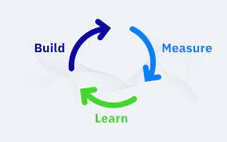
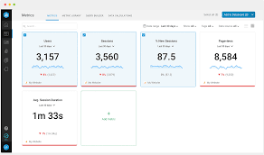

# Tracking Feature adoption 

As an Engineering Manager, one of the things that I look for is how the features we shipped are performing i.e. are they working the way we initially expected or not. These are broadly referred to as Feature Adoption Metrics. There are a lot of ways to skin the cat on this one, and one of the PMs I follow on Twitter, [Shreyas Doshi](https://twitter.com/shreyas), had this to say about adoption metrics 👇🏽

<blockquote class="twitter-tweet">
3/ Adoption metrics  Key question: Is the product (along with its key features) being used as much as we’d hope and in the ways that we’d like?  Examples: active users, dau:mau, N of M day usage, strategic feature adoption trends, free-to-paid conversions,...
&mdash; Shreyas Doshi (@shreyas) <a href="https://twitter.com/shreyas/status/1304628724587929600?ref_src=twsrc%5Etfw">September 12, 2020</a></blockquote> 

While the thread above focuses on the "what", I like to think about the "why" and the "how" when it comes to Feature Adoption metrics.

# Importance of tracking feature adoption

Peter Drucker said “If you can't measure it, you can't manage it.” which is largely considered as canon in product development. The Lean Startup popularized the idea of "Build Measure Learn" to create tight loops of learning. 

Over time, this has morphed into all kinds of terminology be it KPIs, Measures of Success, Acceptance Criteria - all of which seek to determine gauging a successful outcome - be it for a development task, quarterly strategy or for that matter, feature adoption. 

An unconventional way to think of feature adoption is from the perspective of employee retention. Developers are very invested in knowing how their work impacts their team and company. It is important to learn from things that worked well, to show how the shipped work has moved the needle -  as well as the things that did not work well, to show what changes should the developer, or team, make in order to continue the cycle of learning. 

While this seems intuitive, the absence of this feedback loop is actually quite problematic. Employee satisfaction is personal to an individual and is based on a variety of criteria such as compensation, work life balance, etc. However, one of the points that I have seen to consistently rank quite high is the impact of the work. Having a healthy product development organization that communicates these updates amongst each other, helps build a sense of confidence that benefits the development team as well as the company. 

# Framework for measuring Feature adoption 

Product teams that I have worked with have used several methods to gauge success of feature delivery. One such framework that I have found to be useful is something that I term as the SIP framework, as defined below - 

- S stands for Signal 
- I stands for Insight
- P stands for Proposition

## 🚨 Signal 

`Signal` indicates the input or measure or data point that shows how the feature is performing. A Signal could be word-of-mouth feedback from your customer or it could be an actual metric that acts as your Key Performance Indicator that you are tracking in a Dashboard. A Signal provides you with the raw information that will help you observe feature adoption, which you can use to gather `Insights`.

## 🔍 Insight

Given a Signal, Insights are extrapolations or Inferences that you make using that raw data. They are typically 2nd or 3rd order derivations of what is observed with the Signal. Asking questions of the raw data in the Signal is a way to come up with a set of Insights or Hypotheses required to make sense of the indicators you see, in a way that you can proceed to suggest a `Proposition`. 

An example to illustrate this -

- Signal
    - Feedback from user on the Import Purchases workflow: Excel based workflow is challenging and prone to error, and user avoids importing purchases into the system for as long as they can. 

- Insight
    - What makes the experience challenging? Are there too few directions? Are there too many options that are confusing?
    - Why are there so many errors? Something being error-prone could be fundamentally different from it being a challenging experience? One could be related to incorrect input components, or bad data integrity - whereas the other could be related to bad User Experience. These are just some of the ways you can pry apart what a Signal is trying to indicate.

## 🤝 Proposition

Once there are Insights, you have formed a set of hypotheses that might require you to take one or more actions. You either want to do more with the feature that was shipped, whether it is directionally the same as where you initially intended to go, or if there are things you learned that might need you to pivot direction. Or you might have learned something through this process of introspection which makes you decide you shouldn't do anything about it. 

In either case, you now have a Proposition to make - 
- In case of terminating the feature, you will need to draft up some notes for the team and broader stakeholder group, to explain the reason for abandoning the effort or changing course. 
- In case you want to move forward with the next phase in the evolution of the feature (for eg. companies define product progression using terminology like Alpha, Beta, GA ), you will need to make a case for it, possibly using other requests/asks that have come up in the past. 

Explaining the Product (or Feature) Proposition for what the team should work on, by using Signals and Inferences and combining it with how the company perceives Value - helps people understand the "why" behind features they are working on. I have found `SIP` to be a useful framework to gauge the arc of feature adoption and use that to convey product direction. 

Have thoughts you want to share? Hit me up [@raoarjun](https://twitter.com/raoarjun).

### References
- [Build Measure Learn](https://amplitude.com/blog/build-measure-learn-the-product-management-lifecycle-loop)