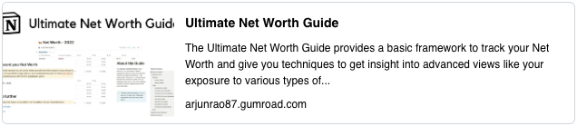

# The Ultimate Net Worth Guide

> Take your first step to Financial Freedom

Being fiscally conservative and careful about money is something that was drilled into me from a very early age. One of the things I learned very quickly is to make sure I always knew how much money I had, which as I grew into adulthood translated to having a keen understanding of what are my investments and debts.

I have created the Ultimate Net Worth Guide to provide a framework of measuring and understanding Net Worth as a tool to ensure you are able to achieve your financial goals in life. You can find out more at this link below -

## What is Net Worth?

The first step on this path of financial security is about as basic as it gets - merely inventory everything you have got. People smarter than me have a name for this and they call it “Net Worth”. This generally includes the following steps -

- Go through all the different accounts you have
- Count as positive things like cash in your account or stocks you might own - also known as Assets
- Count as negative things like like credit card debt or mortgage you might be paying on your house - also known as Liabilities

There you have it, the sum total of your Assets and Liabilities is your Net Worth.

## Why is knowing your Net Worth important?

My fundamental approach to building wealth is how can I make my money work for me, instead of making me work for my money. Getting there takes discipline, and the first step on that path of discipline is to get a lay of the land - or in other words, know where the state of your finances stands currently. Once you get the inventory of your assets and liabilities, you can make informed decisions off that data whether its

- “I need to divert more money towards payment of my credit card debt”
- “I need to invest my cash into the stock market so it works for me”

or any other decision that you have the agency to take on your path to financial freedom. Think of knowing your Net Worth as a map that will help dictate the course of your future actions.

By this point, I hope you understand the importance of keeping track of your Net Worth and how it can positively impact your future. I have been tracking my Net Worth for the past decade or so, and I have a system that works really well for me which I have decided to make available to others to embark upon this mission for themselves.

As a quick reminder, you can learn more about my system and purchase it through Gumroad here ⇒ [Ultimate Net Worth Guide](https://arjunrao87.gumroad.com/l/ultimate-net-worth-guide)

## What does the Guide help with?

The Guide that I have built comes with insight that I have gained after over a decade of learning tricks of the trade of how you should view your own personal financial portfolio. I specifically call it a "Guide", because it is meant to be a resource that you can depend on - something that helps lead you to the future you want to secure.

You can use it in its literal sense, as I have baked in all the things I use to view my own finance - or you can use it as a guiding light on how you should think about getting to financial independence. There are many steps on the path to financial freedom, but you have to start somewhere, and my advice is to start with knowing and then tracking your Net Worth. Once you purchase this Guide, there are a lot more details about specific terminology or ways to think about headwinds (things that propel forward) and tailwinds (thinks that risk forward motion) to your Net Worth.

## Who is this Guide meant for?

First and foremost, this is meant for anyone who wants to get on the path to owning their financial destiny. Specifically -

- If you have been meaning to get more financially responsible, but just don’t know where to start? This is meant for you
- If you have been meaning to FIRE (be Financially Independent, and Retire Early) but haven’t quite figured how? This is meant for you.
- If you want to own your own data, and don’t want to use 3rd party software to track this kind of information? This is meant for you.
- If you are done treading water, and now want to overcome the inertia that has been holding you back? This is meant for you.

## Wanna know more?

I hope to make available several other resources to help keep this journey up, and if there are any questions or thoughts that you have that you would like to see, let me know at @raoarjun on Twitter

💥 Make sure you head to the link below, and set sail on your path to financial freedom!

