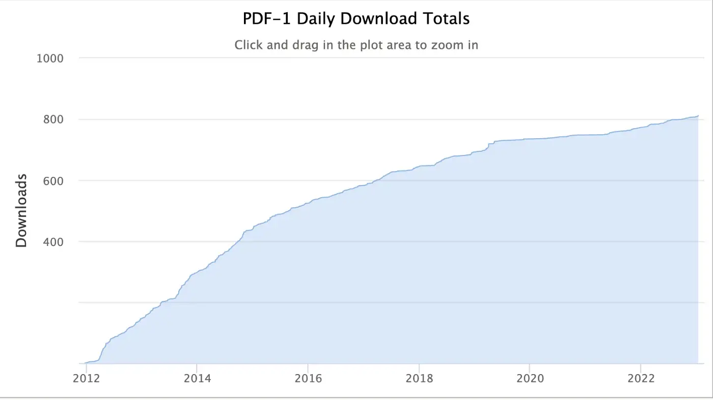
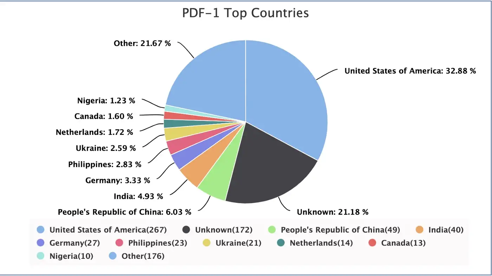

# My Master’s Thesis: 12 years later

When I went to Rutgers for my Masters of Science, I wrote a thesis on “Improving parking garage efficiency using reservation optimization techniques” — yes, a mouthful but it was a lot of effort that resulted in a Master’s Dissertation.

Anyway, many moons have passed since that day, and I received an email from a random SaaS vendor. The email started off with “I loved reading your article _Improving parking garage efficiency using reservation optimization techniques_ and it is so relevant to today’s conversation” and then promptly went into a sales pitch for their product which was of absolutely no relevance to me, and was even less connected to my thesis topic, which suggests they didn’t really read a 159 page document.

After scratching my head for a couple of minutes, I wondered how this person even found the topic of my thesis, so I did a Google search, and lo-and-behold, the first Google search pointed to my [thesis](https://rucore.libraries.rutgers.edu/rutgers-lib/36198/) in the Rutgers Thesis Archive!

It was exciting to see what I had worked on after over a decade and as I was perusing the site, I noticed a section in the left sidebar View Usage Statistics which popped up 3 very interesting things —

- The first one was that my thesis had been downloaded 805 times (at the time of writing) in the last 10+ years, which was 805 times more than I thought people would download it (if I had really even known they could)

- The second was that there was a time-based graph indicating the downloads which indicated a fairly linear increase in the first few years followed by a much smaller gradient increase in the past several years.

- The third was a pie chart of countries from which people downloaded the thesis document.

This to me was the most fascinating because it indicated that while 33% of the downloads came from the USA, it also included countries like Netherlands, Ukraine, Phillippines, Germany and India among others.

Not sure what the point of these findings really is, except that sometimes when you think your work goes unnoticed, you might be mistaken.
